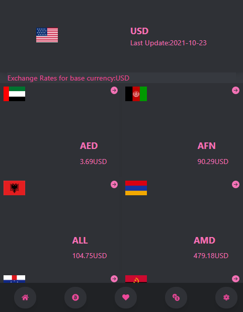

# Currency Exchange Web App

> A Redux based application that shows exchange rates for diffrent currencies.



**Additional description about the project and its features.**

## ⚒️ Built With

`Languages`

- HTML
- CSS
- Javascript

`Library`

- React
- Redux
- Tailwind CSS

## 📡 Live Demo

[Link to Live Demo](https://ahzia.github.io/Currency-Exchange/)


## 🔥 Getting Started

### **Setup**

```bash
git clone https://github.com/ahzia/Currency-Exchange.git
```

### **Prerequisites**

To run this project you need [Node](https://nodejs.org/en/) and [NPM](https://docs.npmjs.com/about-npm-versions) installed on your local machine
<br>
`Note` : When you install Node.js, npm is automatically installed, However, npm is released more frequently than Node.js

### **Available Scripts**

In the project directory, you can run:

#### `npm start`

Runs the app in the development mode.\
Open [http://localhost:3000](http://localhost:3000) to view it in the browser.

The page will reload if you make edits.\
You will also see any lint errors in the console.

#### `npm test`

Launches the test runner in the interactive watch mode.\
See the section about [running tests](https://facebook.github.io/create-react-app/docs/running-tests) for more information.

#### `npm run build`

Builds the app for production to the `build` folder.\
It correctly bundles React in production mode and optimizes the build for the best performance.

The build is minified and the filenames include the hashes.\
Your app is ready to be deployed!

#### `npm run deploy`

The project is deployed in github pages.

### Ahmad Zia Yousufi

- GitHub: [@ahzia](https://github.com/ahzia)
- Twitter: [@ZiaYousofi](https://twitter.com/ZiaYousofi)
- LinkedIn: [Ahmad zia Yousufi](https://https://www.linkedin.com/in/ah-ziayosfi)

## 👊🏾 Show your support

Give a ⭐️ if you like this project!

## 📝 License

This project is [MIT](./LICENSE) licensed.